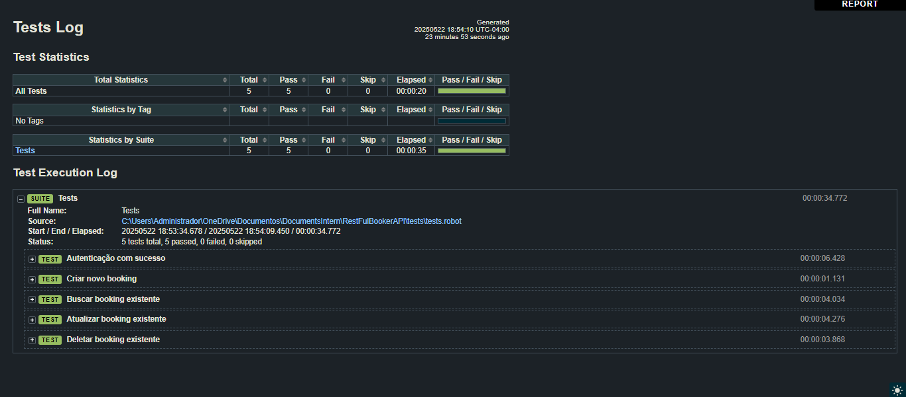

<table>
  <tr>
    <!-- Imagem à esquerda -->
    <td>
      
    </td>
    <!-- Texto central -->
    <td align="center">
      <h2>RestFul Booker API - Testes com Robot Framework</h2>
      

        
        
        
      

    </td>
    <!-- Imagem à direita -->
    <td>
      
    </td>
  </tr>
</table>

  

    Este projeto tem como objetivo automatizar testes da 
    <a href="https://restful-booker.herokuapp.com/apidoc/index.html" target="_blank">
      Restful Booker API
    </a> 
    utilizando <strong>Robot Framework</strong>, focando em autenticação, criação, consulta, atualização e remoção de reservas (bookings).
  

<blockquote>
  <strong> Sobre a API:</strong> 
  A <strong>Restful Booker</strong> é uma API para fins educacionais que permite testar operações <strong>CRUD</strong> com autenticação. 

</blockquote>

---

<h3> Estrutura do Projeto</h3>

 <pre style="background: #eee; padding: 10px; border-left: 5px solid #3e64ff;">
RestFulBookerAPI/
├── resources/
│   ├── Auth.robot           
│   ├── CreateBooking.robot 
│   ├── DeleteBooking.robot  
│   ├── GetBooking.robot     
│   ├── UpdateBooking.robot  
│   └── _base.robot          
├── tests/
│   ├── tests.robot 
│   └── results/
│       ├── log.html
│       ├── output.xml
│       └── report.html
├── requirements.txt      
└── README.md
  </pre>

---

<h3>
  
     Como Executar o Projeto</h3>

<h4>1. Pré-requisitos</h4>
<ul>
  <li>Python 3.8 ou superior</li>
  <li>Pip</li>
  <li>Git (opcional)</li>
</ul>

<h4>2. Clonar o repositório</h4>
<pre><code>git clone https://github.com/karenkessia/Compass_UOL_Intership.git
cd Compass_UOL_Intership/RestFulBookerAPI
</code></pre>

<h4>3. Instalar dependências</h4>

<strong>Com <code>requirements.txt</code>:</strong>

<pre><code>pip install -r requirements.txt
</code></pre>

<strong>Ou manualmente:</strong>

<pre><code>pip install robotframework
pip install robotframework-requests
</code></pre>

<h4>4. Executar os testes</h4>

<strong>Execução padrão:</strong>

<pre><code>robot tests/
</code></pre>

<strong>Com saída customizada (relatórios em <code>results/</code>):</strong>

<pre><code>robot -d results tests/
</code></pre>

---

<table>
  <tr>
    <td style="vertical-align: top; padding-right: 20px;">
      <h3> Relatórios Gerados</h3>
      <ul>
        <li><code>log.html</code> — Log detalhado da execução</li>
        <li><code>report.html</code> — Relatório geral</li>
        <li><code>output.xml</code> — Saída para integrações</li>
      </ul>
      
<strong>✅ Todos os 5 testes passaram com sucesso.</strong>

    </td>
    <td>
      
    </td>
  </tr>
</table>

<!--  Funcionalidades Testadas -->
<h3> Funcionalidades Testadas</h3>
<ul>
  <li> <strong>Autenticação</strong> e obtenção de token</li>
  <li> <strong>Criação</strong> de reservas (POST)</li>
  <li> <strong>Consulta</strong> de reservas (GET)</li>
  <li> <strong>Atualização</strong> de reservas (PUT)</li>
  <li> <strong>Exclusão</strong> de reservas (DELETE)</li>
</ul>

---

<!--  Referências -->
<h3> Referências</h3>
<ul>
  <li><strong>Documentação da Restful Booker API</strong> — <a href="https://restful-booker.herokuapp.com/apidoc/index.html" target="_blank">Ver API</a></li>
  <li><strong>Robot Framework</strong> — Ferramenta de automação de testes</li>
  <li><strong>RequestsLibrary</strong> — Biblioteca para testes HTTP com Robot Framework</li>
</ul>

---

<!--  Créditos das Imagens -->
<h3> Créditos Visuais</h3>

As imagens foram geradas com auxílio de inteligência artificial (Sora, by OpenAI).

---

<!--  Autora -->
<h3>👩‍💻 Autora</h3>

  <strong>Karen Késsia</strong> 
  Estagiária QA na Compass UOL 
  GitHub: <a href="https://github.com/karenkessia" target="_blank">@karenkessia</a>

   

