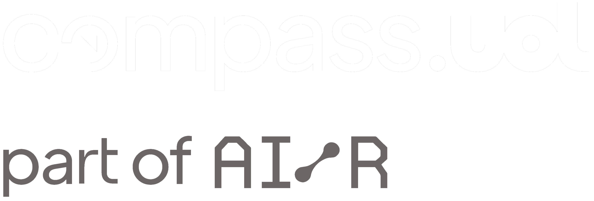

<table width="100%" style="table-layout: fixed;">
  <tr>
    <!-- Imagem à esquerda -->
    <td width="50%" align="center" valign="middle" style="height: 220px;">
      
    </td>
    <!-- Conteúdo central -->
    <td width="75%" align="center" valign="middle">
      <h1 style="display: inline-flex; align-items: center; gap: 10px;">ServeRest API</h1>
      <p>
        Projeto de testes automatizados com <strong>Robot Framework</strong>.<br>
        Aplicando <strong>Keyword-Driven</strong>, <strong>RequestsLibrary</strong> e <strong>FakerLibrary</strong> em testes de API REST.
      </p>
      <p>
        
        
        
      </p>
    </td>
  </tr>
</table>

<div style="width: 100%; display: flex; justify-content: flex-end;">
  <blockquote style="
    font-style: italic; 
    color: #555; 
    border-left: 4px solid #ccc; 
    padding-left: 15px;
    width: 50%;
    text-align: right;">
    Este projeto teve início com a validação manual dos endpoints da API ServeRest por meio do Postman. 
    A partir disso, evoluímos para a automação dos testes utilizando o <strong>Robot Framework</strong>, 
    aplicando uma estrutura baseada em <strong>Keyword-Driven</strong> e integrando bibliotecas como 
    <strong>RequestsLibrary</strong> e <strong>FakerLibrary</strong> para simular cenários realistas e garantir 
    a confiabilidade das funcionalidades testadas.
  </blockquote>
</div>


---

 <h3>📁 Estrutura do Projeto</h3>
  <pre>
ServeRestRobot/
├── resources/                    
│   ├── common.robot             
│   ├── login_keywords.robot      
│   ├── product_keywords.robot    
│   └── user_keywords.robot       
│
├── tests/                        
│   ├── login.robot               
│   ├── produtos.robot           
│   └── usuarios.robot            
│
├── variables/                    
│   └── serverest_vars.robot      
│
├── requirements.txt              
└── README.md                  

  </pre>

---

###  Funcionalidades Implementadas

-  Abordagem **Keyword-Driven** aplicada à estrutura dos testes;
-  Consumo de **APIs REST** com a biblioteca `RequestsLibrary`;
-  Testes com verbos HTTP: `GET`, `POST`, `PUT`, `DELETE`;
-  Autenticação via **Token JWT**;
-  Geração de dados fictícios dinâmicos com `FakerLibrary`;

---

<h3>
  
     Instalação vs Execução</h3>


1. Clone o repositório:
```bash
git clone https://github.com/karenkessia/Compass_UOL_Internship.git
```

2. Acesse o diretório do projeto:
```bash
cd ServeRestRobot
```

3. Crie o ambiente virtual:
```bash
python -m venv env
```

4. Ative o ambiente virtual:
```bash
# No Linux
source env/bin/activate

# No Windows (PowerShell)
.\env\Scripts\Activate.ps1
```

5. Instale as dependências:
```bash
pip install -r requirements.txt
```

Para rodar todos os testes:
```bash
robot tests/
```

<hr/>

<h3> Boas Práticas Aplicadas</h3>
<ul>
  <li><strong>Organização em Camadas:</strong> separação clara entre testes, keywords e variáveis</li>
  <li><strong>Documentação:</strong> keywords e testes com descrições explicativas</li>
  <li><strong>Reutilização:</strong> keywords comuns centralizadas em arquivos próprios</li>
  <li><strong>Parametrização:</strong> keywords com argumentos dinâmicos e flexíveis</li>
  <li><strong>Geração de Dados:</strong> uso estratégico do FakerLibrary para dinamismo</li>
</ul>

---

<h3>Autora</h3>
<p>
  <strong>Karen Késsia</strong><br>
  Estagiária em QA <br>
</p>


<p align="center">
  <br>

</p>
